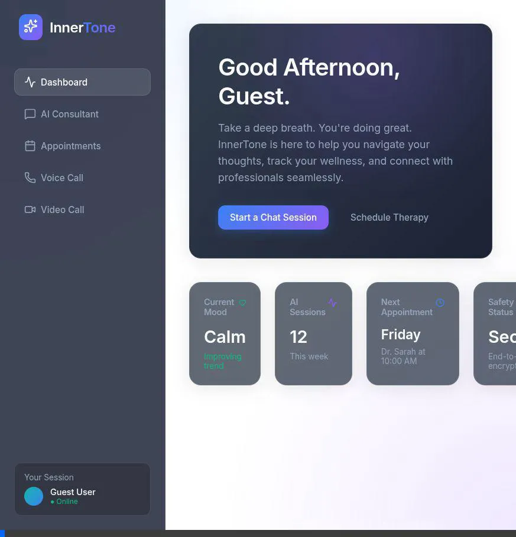

# 🧠 InnerTone — AI Mental-Wellness Consultation Platform

<div align="center">


**A production-grade, AI-powered mental wellness platform — built with empathy and engineering rigor.**

</div>

---

## ✨ What is InnerTone?



> [!NOTE] 
> ### 🔇 Why is there no sound in the demo?
> This video is a silent `WebP` animation because GitHub READMEs do not support auto-playing videos with audio tracks. However, the actual application features a **fully voiced, ultra-low latency conversational AI**. We encourage you to run the project locally to experience the voice yourself!

InnerTone is an AI-powered mental wellness consultation platform that provides:

- 💬 **Chat Support** — CBT-style conversational AI therapy
- 🎙️ **Voice Call Support** — Real-time voice AI sessions
- 📹 **Video Call Support** — Face-to-face video consultations
- 😊 **Emotion Detection** — Real-time user emotion recognition
- 📚 **RAG Knowledge Base** — Retrieved insights from top psychology/CBT books
- 🧠 **Memory System** — Long-term, personalized user memory
- 🚨 **Safety Detection** — Automatic crisis & suicidal ideation detection
- 📅 **Appointment Booking** — Schedule consultations

---

## 🏗️ System Architecture

```
Client Apps
    │
    ▼
FastAPI Gateway (REST + WebSocket)
    │
    ├── Chat & Context Service
    │       ├── Safety Module  ←── Intercepts crisis signals
    │       ├── Emotion Detection
    │       └── LLM Consultant Engine (Gemini)
    │               ├── RAG Retrieval (FAISS + Psychology Books)
    │               └── Long-term Memory (PostgreSQL)
    │
    ├── Voice / Video Call Signaling (WebRTC)
    └── Appointment Booking (PostgreSQL)
```

---

## 🚀 Tech Stack

| Layer | Technology |
|---|---|
| Backend API | FastAPI (async) |
| Language | Python 3.10+ |
| Primary DB | PostgreSQL |
| Vector Search | FAISS (local) |
| LLM + Embeddings | Google Gemini API |
| PDF Parsing | LangChain + PyPDF |
| Embeddings | `models/gemini-embedding-001` |

---

## 📁 Project Structure

```
InnerTone/
├── Books/                          # Psychology/CBT PDF books (local RAG source)
├── innertone/
│   ├── core/
│   │   ├── config.py               # Pydantic settings
│   │   └── database.py             # Async SQLAlchemy engine
│   ├── models/
│   │   └── document_metadata.py    # ORM model for chunk metadata
│   ├── rag/
│   │   ├── ingest.py               # PDF ingestion pipeline (chunk + embed + store)
│   │   └── retrieve.py             # Semantic query against FAISS
│   ├── services/                   # Consultant, Safety, Emotion, Memory services
│   └── api/v1/                     # FastAPI routers
├── init_db.py                      # Initialize DB tables
├── .env                            # Environment variables
├── requirements.txt                # Python dependencies
└── tests/                          # Pytest suite
```

---

## ⚙️ Setup & Installation

### 1. Clone the repository

```bash
git clone https://github.com/Shreyxpatil/InnerTone.git
cd InnerTone
```

### 2. Create and activate virtual environment

```bash
python3 -m venv .venv
source .venv/bin/activate
```

### 3. Install dependencies

```bash
pip install fastapi uvicorn sqlalchemy asyncpg psycopg2-binary faiss-cpu \
    langchain langchain-community langchain-google-genai \
    google-generativeai pypdf python-dotenv pydantic-settings gunicorn
```

### 4. Configure environment variables

Copy `.env.example` to `.env` and fill in your values:

```bash
cp .env.example .env
```

Required variables:
```env
DATABASE_URL=postgresql+asyncpg://<user>:<password>@localhost:5432/<dbname>
GEMINI_API_KEY=your-gemini-api-key-here
ENVIRONMENT=development
```

### 5. Set up PostgreSQL

```sql
CREATE DATABASE innertone;
CREATE USER innertone_user WITH PASSWORD 'yourpassword';
GRANT ALL PRIVILEGES ON DATABASE innertone TO innertone_user;
GRANT ALL ON SCHEMA public TO innertone_user;
```

### 6. Initialize the database

```bash
python init_db.py
```

### 7. Run the RAG ingestion pipeline

Place your psychology/CBT PDF books in the `Books/` folder, then:

```bash
PYTHONPATH=. python innertone/rag/ingest.py
```

> ⚠️ **Note:** If you are on the Gemini free tier (15 RPM), ingestion uses batching + delays to stay within limits. Full ingestion of all books may take time.

---

## 📚 RAG Pipeline (Phase 1)

The ingestion pipeline:

1. **Loads** all PDFs from `Books/`
2. **Chunks** text with 400-600 token chunks and 200-char overlap
3. **Embeds** each chunk using Gemini `models/gemini-embedding-001`
4. **Stores** vectors in a local FAISS index (`innertone_index.faiss`)
5. **Stores** metadata (book name, section, page, content) in PostgreSQL

Each chunk records:
- `book_name` — Source PDF
- `section` — Page reference
- `content` — Full text chunk
- `faiss_id` — FAISS vector index ID

---

## 🛡️ Safety System

InnerTone automatically detects:

- Self-harm intent
- Suicidal ideation
- Severe emotional distress

When detected, the normal AI response is **halted**, emergency helplines are displayed, and the conversation is flagged as high-risk.

---

## 🤖 AI Consultant Response Format

All AI responses follow the CBT-guided format:

1. **Acknowledge** the user's emotion
2. **Logical Reflection** — reframe the situation
3. **Coping Suggestion** — actionable, small step
4. **Follow-up Question** — deepen understanding

---

## 🗺️ Roadmap

- [x] Phase 1: RAG Pipeline from local books
- [ ] Phase 2: LLM Consultant Engine (Gemini)
- [ ] Phase 3: Emotion Detection
- [ ] Phase 4: Safety System
- [ ] Phase 5: Chat System (FastAPI)
- [ ] Phase 6: Memory System
- [x] Phase 7: Voice Call Support
- [x] Phase 8: Video Call Support
- [ ] Phase 9: Appointment Booking
- [ ] Phase 10: Deployment

---

## 📄 License

This project is licensed under the MIT License.

---

<div align="center">
  Built with ❤️ and code by <a href="https://github.com/Shreyxpatil">Shreyxpatil</a>
</div>
